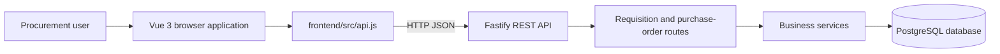
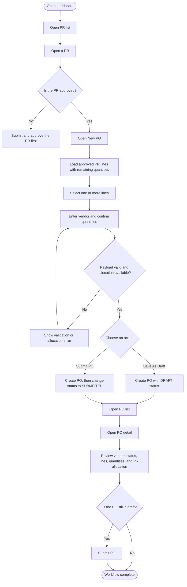
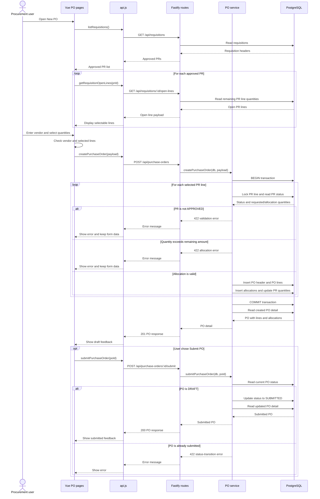
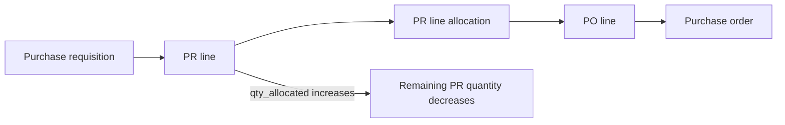

# Procurement MVP Application Overview

## Purpose

The application is a small procurement management system. It gives users a single place to create and review purchase requisitions (PRs), then create and submit purchase orders (POs) from approved PR lines.

The current implementation covers:

- Home dashboard with PR status counts
- Purchase requisition list, create, and detail pages
- Purchase order list, create, detail, and submit pages
- REST APIs backed by PostgreSQL

Goods receipt (GR) pages and APIs are not implemented in the current application. PO detail can show received and open quantities because those fields exist in the data model, but receiving is outside the current workflow.

## Application Structure

The browser runs a Vue 3 application. Vue pages call the API wrapper in `frontend/src/api.js`, which sends JSON requests to the Fastify backend. Fastify registers requisition and purchase-order routes, and the route handlers delegate business rules to service functions. The services read and write PostgreSQL through the database plugin.

## Main User Flow

An approved PR is the starting point for PO creation. The create page loads open lines from approved requisitions, copies the selected line details into the PO payload, and lets the user save a draft or submit immediately.

## PO Creation and Submission Sequence

The frontend performs basic checks for a vendor and selected lines, but the backend remains authoritative. During PO creation, the service locks each referenced PR line, confirms that its PR is `APPROVED`, and rejects quantities greater than the remaining amount before committing the PO and allocation records.

## Routes and Pages

### Frontend routes

| Route | Page | Purpose |
| --- | --- | --- |
| `/` | Dashboard | Summarize requisition status and recent PRs |
| `/requisitions` | PR list | Browse requisitions |
| `/requisitions/new` | PR create | Enter a new requisition |
| `/requisitions/:id` | PR detail | Review, submit, and approve a requisition |
| `/purchase-orders` | PO list | Browse purchase orders |
| `/purchase-orders/new` | PO create | Allocate approved PR lines to a new PO |
| `/purchase-orders/:id` | PO detail | Review or submit a PO |

### Purchase order API

| Method | Endpoint | Behavior |
| --- | --- | --- |
| `GET` | `/api/purchase-orders` | Return PO headers ordered by creation date |
| `POST` | `/api/purchase-orders` | Validate allocations and create a draft PO |
| `POST` | `/api/purchase-orders/:id/submit` | Move a draft PO to `SUBMITTED` |
| `GET` | `/api/purchase-orders/:id` | Return a PO with lines and PR allocation sources |
| `GET` | `/api/purchase-orders/:id/open-lines` | Return PO lines with quantity still open for receiving |

## Business Rules

- A PO can only allocate lines from a PR whose status is `APPROVED`.
- A PO allocation cannot exceed the PR line's remaining quantity.
- PO creation validates all referenced lines inside a database transaction.
- PR line rows are locked during allocation to protect against concurrent over-allocation.
- A PO starts in `DRAFT` status.
- Only a `DRAFT` PO can transition to `SUBMITTED`.
- The submit action is available on the detail page only while the PO is a draft.
- Invalid requests return a JSON error with a readable `message`; the frontend displays that message without leaving the loading state active.

## Data Relationships

The important records for the current workflow are connected as follows:

The allocation bridge preserves the source PR line for each PO line, so PO detail can show which PR number supplied the ordered quantity.

## Current Scope Boundary

The implemented application ends after PO review and submission. Goods receipt is the next business step, but it is intentionally left for further exploration in this workshop. The planned future flow is `SUBMITTED PO -> goods receipt -> posted receipt -> updated fulfillment quantities`.